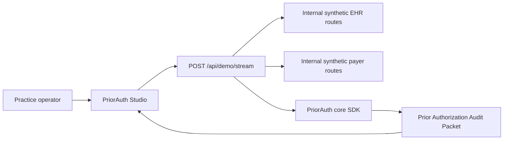
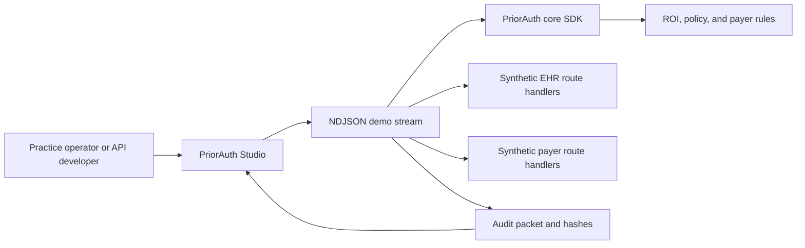
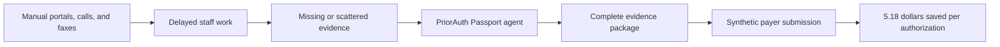
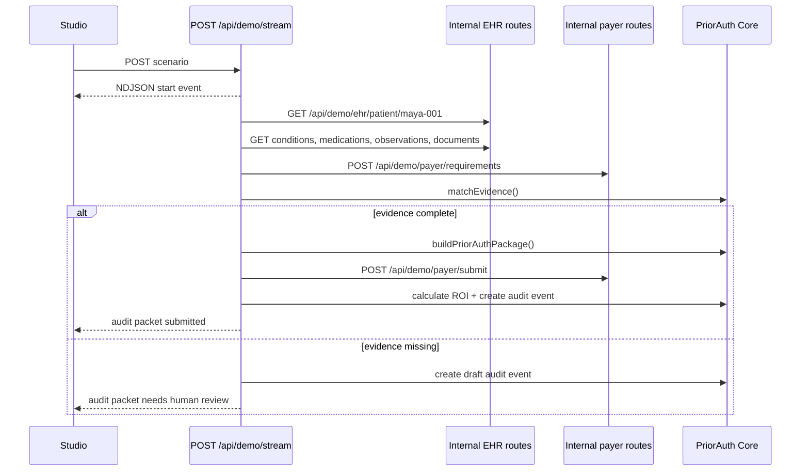

# PriorAuth Passport

Real-time electronic prior authorization infrastructure for provider practices
and health API teams.

PriorAuth Passport automates the administrative prior-auth path: intake,
requirement discovery, EHR evidence gathering, package building, payer
submission, ROI calculation, and audit evidence. It runs with synthetic data,
same-origin demo APIs, optional local HTTP services, a TypeScript SDK core, a
CLI, and a live Next.js Studio.

## Who uses it?

| User | What they do |
| --- | --- |
| Practice operations manager | Runs prior-auth cases, sees missing documents, cost saved, minutes saved, and audit evidence. |
| Health-tech API developer | Embeds the SDK, configures payer rules, and integrates EHR and payer APIs. |
| Payer/platform engineer | Tests prior-auth requirement and submission flows while preparing for API-first workflows. |

## Demo

```bash
pnpm install
pnpm studio
```

Open [http://localhost:3000](http://localhost:3000), then click:

1. `Start live demo`
2. `Check gaps`

The default demo is hosted/Vercel-ready: Studio calls internal Next.js route
handlers for synthetic EHR and payer APIs. No localhost `4001` or `4002`
service is required for the web demo.



The UI reads newline-delimited JSON from `/api/demo/stream`. Each event includes
agent, tool call, API exchange, proof row, ROI, and audit packet metadata so the
operator can see where data is fetched and why a case was submitted or blocked.

`pnpm demo` still starts optional Fastify EHR and payer services for local API
experiments and CLI compatibility.

You can also trigger the same workflow from the CLI while Studio updates live:

```bash
pnpm run doctor
pnpm priorauth submit --case pa-case-001
pnpm priorauth submit --case pa-case-001 --scenario incomplete
```

## Studio Surfaces

```text
1. Metric-first landing
2. Live demo workspace
3. Overview
4. Prior Auth Inbox
5. Live Workflow
6. ROI Calculator
7. Evidence & Requirements
8. Audit Ledger
9. Developer Mode
10. Settings
```

The first viewport is numbers-first: `$10.97`, `$5.79`, `$5.18`, `16 min`,
`7-14 min`, evidence status, and proof status. The live workspace immediately
below shows the agent workflow, tool calls, data ingest, request/response
inspector, proof rows, and copy/download audit packet controls.

## What the demo proves

| Workflow | Provider cost | Staff time | Audit posture |
| --- | ---: | ---: | --- |
| Manual prior auth | $10.97 | 16 min | Weak portal/fax trail |
| PriorAuth Passport | $5.79 | 9 min | Structured event and hash trail |

Default ROI is the transaction delta only: `$5.18` per authorization. Labor time
is shown separately as sensitivity analysis, so the demo does not double-count
ROI.

## Architecture



## Problem to Impact



## Realtime Flow



## Repo Map

```text
apps/sample-ehr-api/       Synthetic FHIR-like EHR service
apps/sample-payer-api/     Synthetic payer requirements and submission service
packages/priorauth-core/   TypeScript SDK for ROI, evidence, package, audit
packages/cli/              priorauth CLI for init, doctor, submit, sign
src/app/                   Next.js Studio and API routes
src/components/dashboard/  Live prior-auth UI panels
config/                    ROI, policy, payer rules
.priorauth/                Demo agent and delegation config
docs/                      Architecture, APIs, demo, security, roadmap
```

## Commands

```bash
pnpm studio        # hosted-ready Studio with internal APIs
pnpm demo          # optional EHR + payer + Studio local services
pnpm typecheck
pnpm lint
pnpm test
pnpm e2e
pnpm verify
pnpm docs:diagrams:render
pnpm run doctor
pnpm priorauth submit
```

## Safety Boundary

PriorAuth Passport is an administrative workflow demo. It uses synthetic data,
does not make medical-necessity determinations, does not provide medical advice,
and does not replace payer clinical review.

## References

- CMS Interoperability and Prior Authorization Final Rule: impacted payers have
  API compliance dates generally beginning January 1, 2027.
  <https://www.cms.gov/newsroom/fact-sheets/cms-interoperability-and-prior-authorization-final-rule-cms-0057-f>
- CMS electronic prior authorization overview:
  <https://www.cms.gov/priorities/electronic-prior-authorization/overview>
