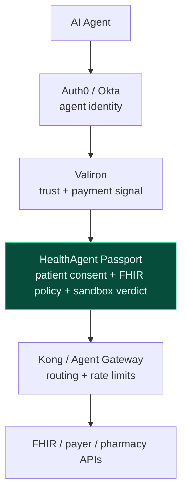
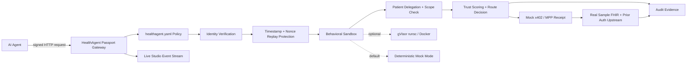
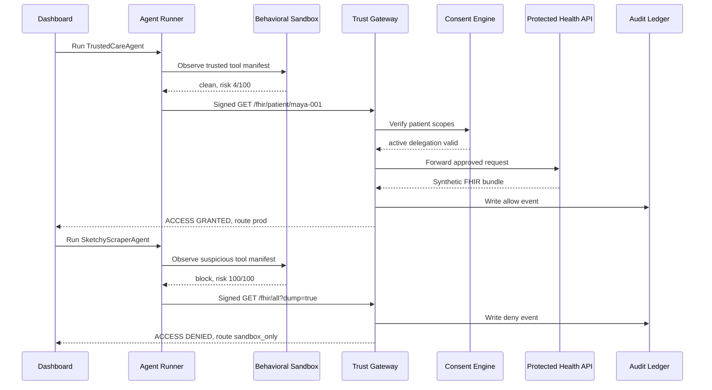
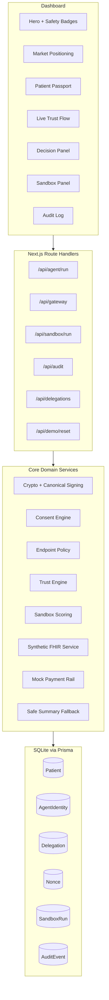

# HealthAgent Passport

HealthAgent Passport is an installable agent firewall for healthcare APIs.

A health API developer puts it in front of a FHIR, payer, pharmacy, or
prior-auth API. AI agents call the gateway, not the API. The gateway verifies
agent identity, patient-scoped consent, sandbox behavior, trust route, payment,
and audit evidence before forwarding approved requests upstream.

> We are not building an AI doctor. We are building infrastructure that makes
> healthcare APIs safer for AI agents.

## Quickstart

```bash
git clone https://github.com/roshaninfordham/healthagentpassport.git
cd healthagentpassport
pnpm install
pnpm demo
```

Open:

```txt
http://localhost:3000
```

The demo starts three services:

```txt
Sample health API:        http://localhost:4001
HealthAgent gateway:      http://localhost:8787
Studio control plane:     http://localhost:3000
```

## Protect Your Own API

```bash
npx healthagent init
npx healthagent gateway \
  --policy ./healthagent.yaml \
  --upstream http://localhost:4001 \
  --port 8787 \
  --studio http://localhost:3000
```

Then send agent traffic to the gateway:

```bash
npx healthagent agent run trusted --gateway http://localhost:8787
npx healthagent agent run attack --gateway http://localhost:8787
```

SDK usage:

```ts
import { createGateway } from "@healthagent/passport";

const gateway = createGateway({
  policyFile: "./healthagent.yaml",
  upstream: "http://localhost:4001",
  studio: "http://localhost:3000",
  demoDelayMs: 650
});

gateway.listen(8787);
```

## What The Demo Proves

Two AI agents attempt to access the same protected healthcare workflow:

- `TrustedCareAgent` has a valid identity signature, active patient delegation,
  correct scopes, clean sandbox behavior, high trust, protected synthetic FHIR
  access through the gateway, prior authorization output, and audit events.
- `SketchyScraperAgent` has a valid agent key but missing patient delegation,
  low trust, suspicious sandbox behavior, an attempted bulk FHIR dump path, and
  a denial before the upstream API is called.

The central product moment:

```txt
Trusted agent: forwarded to the real sample upstream API.
Low-trust or suspicious agent: blocked before touching upstream.
```

## Market Positioning

HealthAgent Passport is the healthcare-specific policy brain between agent
identity, agent trust rails, generic gateways, and protected health APIs.



```txt
Generic agent gateways know traffic.
HealthAgent Passport knows healthcare permission.
```

## Architecture At A Glance



## Demo Flow



## System Layers



## Demo Buttons

1. Click `Run TrustedCareAgent`.
2. Confirm the UI streams signature, nonce, sandbox, consent, scope, trust,
   payment, upstream fetch, hash, audit, and response steps.
3. Confirm the UI shows `ACCESS GRANTED`, route `prod`, and upstream calls for
   `GET /fhir/patient/maya-001` and `POST /prior-auth`.
4. Click `Run SketchyScraperAgent`.
5. Confirm the UI shows `ACCESS DENIED`, route `sandbox_only`, and `Upstream API
   was NOT called`.
6. Confirm `Bulk dump hits` stays `0`.

## Verification

```bash
pnpm verify
pnpm e2e
```

Current test coverage includes:

- Ed25519 signature verification and canonical JSON hashing
- Endpoint policy and trust route thresholds
- Sandbox risk scoring and route downgrade behavior
- Browser e2e path for trusted allow and sketchy deny

## Feature Flags

Defaults are deterministic and offline-friendly:

```env
VALIRON_MODE="mock"
SOLANA_MODE="mock"
PAYMENT_MODE="mock"
LLM_MODE="mock"
SANDBOX_MODE="mock"
SANDBOX_ALLOW_DOCKER="false"
ALLOW_REAL_PHI="false"
```

External integrations are optional:

- Valiron: trust-route adapter in [src/lib/valiron.ts](src/lib/valiron.ts)
- Solana: consent hash anchoring mock in [src/lib/solana.ts](src/lib/solana.ts)
- OpenAI: structured-output-ready summary fallback in [src/lib/llm.ts](src/lib/llm.ts)
- gVisor: optional container sandbox path in [src/lib/sandbox/sandbox-runner.ts](src/lib/sandbox/sandbox-runner.ts)

## Repository Map

```txt
src/app/                  Next.js pages and API route handlers
src/components/dashboard/ Dashboard UI components
src/lib/                  Gateway, trust, consent, sandbox, crypto, services
packages/passport/        TypeScript SDK and reverse-proxy gateway
packages/cli/             healthagent CLI
apps/sample-health-api/   Real local upstream API protected by the gateway
src/tests/                Unit tests
tests/                    Playwright e2e test
prisma/                   SQLite schema and seed data
sandbox/                  Optional Docker/gVisor scenario runner
docs/                     Quickstart, architecture, security, API, demo docs
```

## Documentation

- [Documentation Index](docs/README.md)
- [Developer Quickstart](docs/quickstart.md)
- [System Architecture](docs/architecture.md)
- [Market Positioning](docs/market-positioning.md)
- [API Reference](docs/api-reference.md)
- [Security Model](docs/security-model.md)
- [Demo Guide](docs/demo-guide.md)
- [gVisor Setup](docs/gvisor-setup.md)
- [Rust Gateway Roadmap](docs/rust-roadmap.md)

## Safety Boundaries

- No real PHI is used.
- No diagnosis or treatment recommendation is generated.
- LLM output never authorizes access.
- Protected data is only returned after gateway approval.
- The sandbox is defense-in-depth, not a replacement for authorization.
