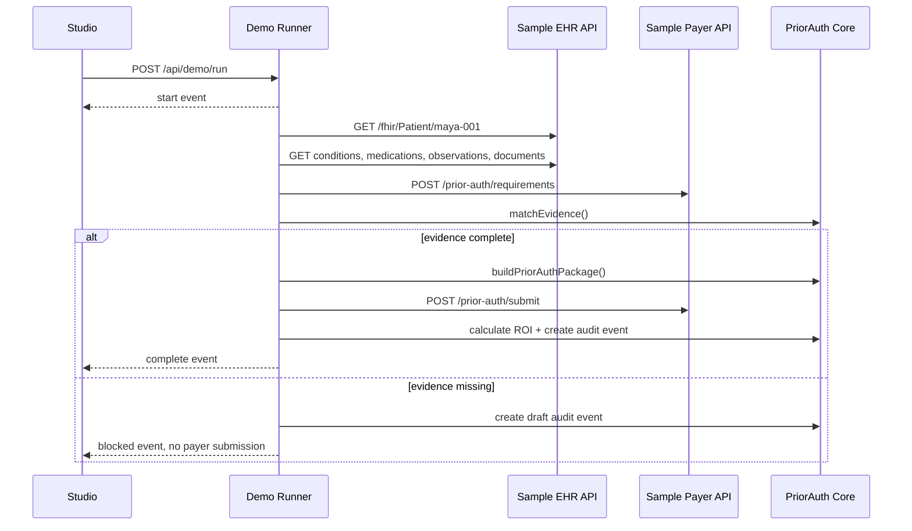

# PriorAuth Passport

Real-time electronic prior authorization infrastructure for provider practices
and health API teams.

PriorAuth Passport automates the administrative prior-auth path: intake,
requirement discovery, EHR evidence gathering, package building, payer
submission, ROI calculation, and audit evidence. It runs with synthetic data,
real local HTTP services, a TypeScript SDK core, a CLI, and a live Next.js
Studio.

## Who uses it?

| User | What they do |
| --- | --- |
| Practice operations manager | Runs prior-auth cases, sees missing documents, cost saved, minutes saved, and audit evidence. |
| Health-tech API developer | Embeds the SDK, configures payer rules, and integrates EHR and payer APIs. |
| Payer/platform engineer | Tests prior-auth requirement and submission flows while preparing for API-first workflows. |

## Demo

```bash
pnpm install
pnpm demo
```

Open [http://localhost:3000](http://localhost:3000), then click:

1. `Run complete ePA case`
2. `Run incomplete documentation case`

The demo starts three real local services:

```text
Studio:          http://localhost:3000
Sample EHR API: http://localhost:4001
Sample Payer:   http://localhost:4002
```

The UI streams each step through server-sent events: patient fetch, condition
fetch, medication fetch, observation fetch, document fetch, payer requirements,
evidence matching, package build, payer submission, ROI, and audit.

## What the demo proves

| Workflow | Provider cost | Staff time | Audit posture |
| --- | ---: | ---: | --- |
| Manual prior auth | $10.97 | 16 min | Weak portal/fax trail |
| PriorAuth Passport | $5.79 | 9 min | Structured event and hash trail |

Default ROI is the transaction delta only: `$5.18` per authorization. Labor time
is shown separately as sensitivity analysis, so the demo does not double-count
ROI.

## Architecture

```mermaid
flowchart LR
  User[Practice operator or API developer] --> Studio[PriorAuth Studio<br/>Next.js :3000]
  Studio --> Runner[Electronic PA runner<br/>SSE event source]
  Runner --> Core[@priorauth/passport-core<br/>ROI + evidence + audit]
  Runner --> EHR[Sample EHR API<br/>Fastify :4001]
  Runner --> Payer[Sample Payer API<br/>Fastify :4002]
  Core --> Config[config/roi.yaml<br/>priorauth-policy.yaml<br/>payer-rules.yaml]
  Runner --> Audit[Audit hash event]
  Audit --> Studio
```

## Realtime Flow



## Repo Map

```text
apps/sample-ehr-api/       Synthetic FHIR-like EHR service
apps/sample-payer-api/     Synthetic payer requirements and submission service
packages/priorauth-core/   TypeScript SDK for ROI, evidence, package, audit
packages/cli/              priorauth CLI for init, doctor, submit, sign
src/app/                   Next.js Studio and API routes
src/components/dashboard/  Live prior-auth UI panels
config/                    ROI, policy, payer rules
.priorauth/                Demo agent and delegation config
docs/                      Architecture, APIs, demo, security, roadmap
```

## Commands

```bash
pnpm demo          # EHR + payer + Studio
pnpm typecheck
pnpm lint
pnpm test
pnpm e2e
pnpm verify
pnpm --filter @priorauth/passport-cli dev doctor
pnpm --filter @priorauth/passport-cli dev submit
```

## Safety Boundary

PriorAuth Passport is an administrative workflow demo. It uses synthetic data,
does not make medical-necessity determinations, does not provide medical advice,
and does not replace payer clinical review.

## References

- CMS Interoperability and Prior Authorization Final Rule: impacted payers have
  API compliance dates generally beginning January 1, 2027.
  <https://www.cms.gov/newsroom/fact-sheets/cms-interoperability-and-prior-authorization-final-rule-cms-0057-f>
- CMS electronic prior authorization overview:
  <https://www.cms.gov/priorities/electronic-prior-authorization/overview>
