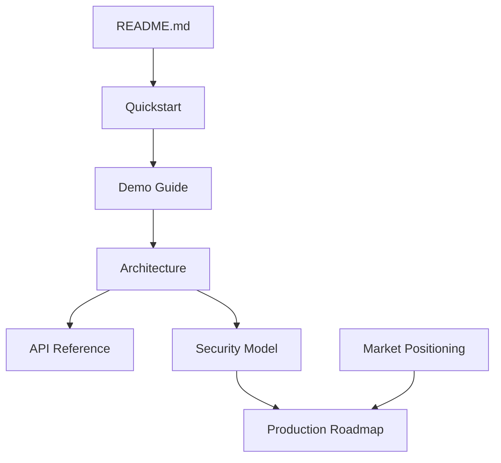

# PriorAuth Passport Documentation

This folder explains the product, demo, architecture, API surface, security
boundary, market position, and production roadmap.

## Start Here

1. [Quickstart](quickstart.md) gets the three-service demo running.
2. [Demo Guide](demo-guide.md) gives the live presenter flow.
3. [Architecture](architecture.md) documents the system design with Mermaid.
4. [API Reference](api-reference.md) lists Studio, EHR, payer, and CLI surfaces.
5. [Security Model](security-model.md) defines the synthetic-data and
   no-treatment-decision boundary.
6. [Market Positioning](market-positioning.md) explains who buys and why.
7. [Production Roadmap](production-roadmap.md) outlines the path from demo to
   deployable SDK/service.

## Documentation Map

## Product Summary

PriorAuth Passport is a real-time electronic prior authorization ROI agent for
provider practices and health-tech API developers. It turns a prior-auth request
into a structured workflow: discover payer requirements, gather synthetic EHR
evidence, block incomplete packages, submit complete packages, calculate ROI, and
write audit hashes.
