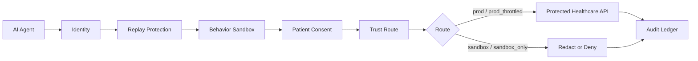

# HealthAgent Passport Documentation

This folder explains the product, architecture, security model, API surface, and
demo operations for HealthAgent Passport.

## Reading Path

1. [System Architecture](architecture.md) explains the end-to-end design with
   Mermaid diagrams.
2. [API Reference](api-reference.md) documents the route handlers and request
   payloads.
3. [Security Model](security-model.md) maps controls to the agentic healthcare
   threat model.
4. [Demo Guide](demo-guide.md) gives the live demo script, checklist, and
   troubleshooting steps.
5. [gVisor Setup](gvisor-setup.md) explains the optional real sandbox runtime.

## Product In One Diagram

## Core Invariants

- Every protected request must be signed.
- Every signed request must use a fresh nonce and timestamp.
- Every healthcare endpoint must have an explicit policy.
- Patient-scoped endpoints require active delegation and exact scopes.
- Trust cannot override missing consent.
- Sandbox results can downgrade trust, but cannot grant consent.
- Denied agents never receive protected synthetic FHIR data.
- Every allow or deny decision writes an audit event.
