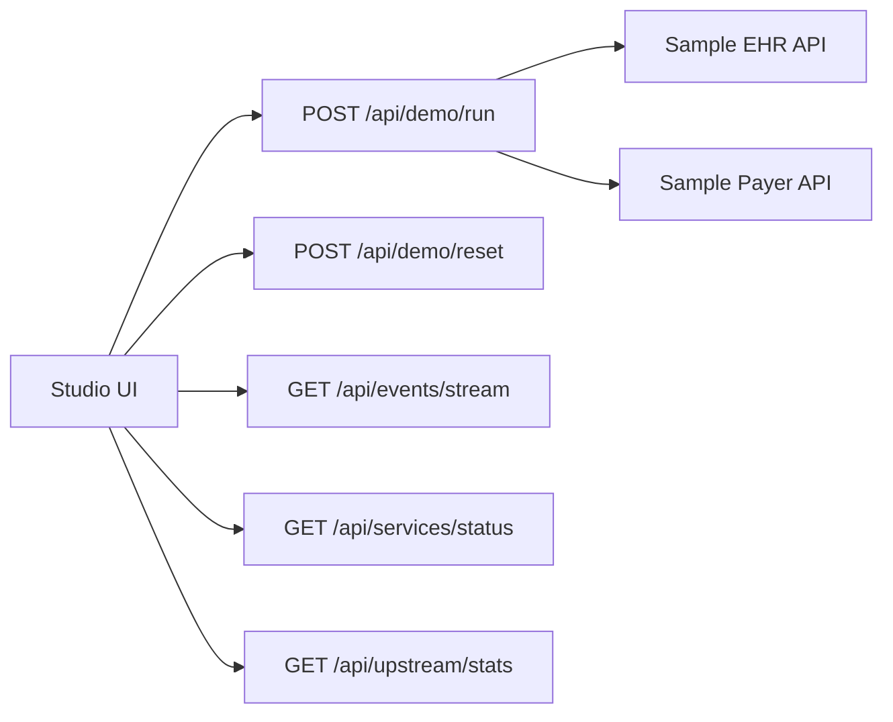

# API Reference

All APIs are local demo APIs and use synthetic data only.

## Studio API



### `POST /api/demo/run`

Starts a live prior-auth workflow and streams events over
`/api/events/stream`.

Request:

```json
{
  "scenario": "complete",
  "caseId": "pa-case-001"
}
```

`scenario` can be `complete` or `incomplete`.

Response:

```json
{
  "runId": "uuid",
  "caseId": "pa-case-001",
  "scenario": "complete"
}
```

### `POST /api/demo/reset`

Clears in-memory run state and resets EHR and payer counters.

### `GET /api/events/stream`

Server-sent event stream for `PriorAuthRunEvent` objects.

Phases:

```text
start
load_case
verify_agent
fetch_patient
fetch_conditions
fetch_medications
fetch_observations
fetch_documents
discover_payer_requirements
match_evidence
build_package
submit_prior_auth
calculate_roi
write_audit
complete
blocked
```

### `POST /api/events/ingest`

Accepts externally produced demo events. This is useful for SDK and CLI
experiments that want to stream into Studio.

### `GET /api/services/status`

Returns health for Studio, EHR API, payer API, ROI config, and policy config.

### `GET /api/upstream/stats`

Returns live HTTP counters from sample services.

### `GET /api/runs/latest`

Returns the latest in-memory run and recent runs.

### `GET /api/runs/:runId/events`

Returns events for one run.

## Sample EHR API

Default URL: `http://localhost:4001`

| Method | Path | Purpose |
| --- | --- | --- |
| `GET` | `/health` | Service health |
| `GET` | `/fhir/Patient/:id` | Synthetic patient demographics |
| `GET` | `/fhir/Condition?patient=:id` | Diagnosis bundle |
| `GET` | `/fhir/MedicationRequest?patient=:id` | Medication bundle |
| `GET` | `/fhir/Observation?patient=:id` | Observation bundle |
| `GET` | `/documents?patient=:id` | Supporting documents |
| `GET` | `/stats` | Request counters |
| `POST` | `/stats/reset` | Reset counters |

`scenario=incomplete` removes observations and referral note evidence.

## Sample Payer API

Default URL: `http://localhost:4002`

| Method | Path | Purpose |
| --- | --- | --- |
| `GET` | `/health` | Service health |
| `POST` | `/prior-auth/requirements` | Return required evidence |
| `POST` | `/prior-auth/submit` | Accept complete package |
| `GET` | `/prior-auth/:id/status` | Return pending review status |
| `GET` | `/stats` | Request counters |
| `POST` | `/stats/reset` | Reset counters |

## Core SDK

Package: `@priorauth/passport-core`

Key functions:

```ts
getSeedCase(caseId)
loadRoiConfig(path?)
calculatePerAuthRoi(input)
calculatePracticeRoi(input)
matchEvidence(input)
buildPriorAuthPackage(input)
createAuditEvent(input)
signText(privateKeyPem, text)
verifyText(publicKeyPem, text, signature)
```

## CLI

Package: `@priorauth/passport-cli`

```bash
priorauth init
priorauth demo
priorauth doctor
priorauth submit --case pa-case-001 --studio http://localhost:3000
priorauth sign
```
