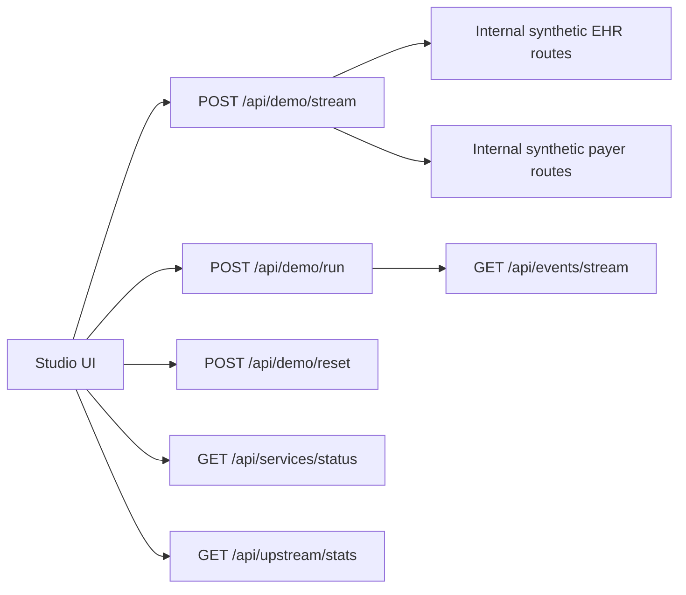
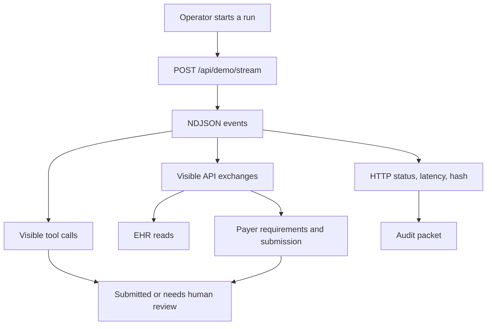

# API Reference

All APIs are local demo APIs and use synthetic data only.

## Studio API



## API Lifecycle



### `POST /api/demo/stream`

Starts a live hosted-ready workflow and returns newline-delimited JSON events.
This is the primary web demo API.

Request:

```json
{
  "scenario": "complete",
  "caseId": "pa-case-001"
}
```

`scenario` can be `complete` or `incomplete`.

Response:

```http
content-type: application/x-ndjson
```

Each line is a `PriorAuthRunEvent`:

```json
{
  "phase": "fetch_patient",
  "status": "passed",
  "details": {
    "agent": "EvidenceAgent",
    "summary": "Patient maya-001",
    "toolCall": {
      "id": "fetch_patient",
      "name": "getPatient",
      "status": "passed",
      "input": { "patientId": "maya-001" }
    },
    "apiExchange": {
      "id": "fetch_patient",
      "label": "EHR patient",
      "source": "ehr",
      "method": "GET",
      "url": "/api/demo/ehr/patient/maya-001",
      "status": "passed"
    },
    "proofRows": [
      {
        "method": "GET",
        "path": "/api/demo/ehr/patient/maya-001",
        "status": 200,
        "latencyMs": 24,
        "hash": "a50aa92b7a"
      }
    ]
  }
}
```

Phases:

```text
start
load_case
verify_agent
fetch_patient
fetch_conditions
fetch_medications
fetch_observations
fetch_documents
discover_payer_requirements
match_evidence
build_package
submit_prior_auth
calculate_roi
write_audit
complete
blocked
```

### `POST /api/demo/run`

Legacy compatibility API. It starts a run and persists events for the old
`/api/events/stream` SSE surface. The default implementation uses internal
relative EHR and payer routes unless `EHR_API_URL` or `PAYER_API_URL` is set.

### `POST /api/demo/reset`

Clears in-memory run state and resets internal or external EHR and payer
counters.

### `GET /api/events/stream`

Legacy server-sent event stream for `PriorAuthRunEvent` objects.

### `POST /api/events/ingest`

Accepts externally produced demo events. This is useful for SDK and CLI
experiments that want to stream into Studio.

### `GET /api/services/status`

Returns health for Studio, EHR API, payer API, ROI config, and policy config.

### `GET /api/upstream/stats`

Returns live HTTP counters from sample services.

### `GET /api/runs/latest`

Returns the latest in-memory run and recent runs.

### `GET /api/runs/:runId/events`

Returns events for one run.

## Sample EHR API

Hosted default: same-origin internal routes under `/api/demo/ehr`.

Optional local Fastify URL: `http://localhost:4001`

| Method | Path | Purpose |
| --- | --- | --- |
| `GET` | `/api/demo/ehr/patient/:id` | Synthetic patient demographics |
| `GET` | `/api/demo/ehr/conditions?patient=:id` | Diagnosis bundle |
| `GET` | `/api/demo/ehr/medications?patient=:id` | Medication bundle |
| `GET` | `/api/demo/ehr/observations?patient=:id` | Observation bundle |
| `GET` | `/api/demo/ehr/documents?patient=:id` | Supporting documents |
| `GET` | `/api/upstream/stats` | Request counters |
| `POST` | `/api/upstream/stats` | Reset counters |

`scenario=incomplete` removes observations and referral note evidence.

## Sample Payer API

Hosted default: same-origin internal routes under `/api/demo/payer`.

Optional local Fastify URL: `http://localhost:4002`

| Method | Path | Purpose |
| --- | --- | --- |
| `POST` | `/api/demo/payer/requirements` | Return required evidence |
| `POST` | `/api/demo/payer/submit` | Accept complete package |
| `GET` | `/api/upstream/stats` | Request counters |
| `POST` | `/api/upstream/stats` | Reset counters |

## Core SDK

Package: `@priorauth/passport-core`

Key functions:

```ts
getSeedCase(caseId)
loadRoiConfig(path?)
calculatePerAuthRoi(input)
calculatePracticeRoi(input)
matchEvidence(input)
buildPriorAuthPackage(input)
createAuditEvent(input)
signText(privateKeyPem, text)
verifyText(publicKeyPem, text, signature)
```

## CLI

Package: `@priorauth/passport-cli`

```bash
priorauth init
priorauth demo
priorauth doctor
priorauth submit --case pa-case-001 --studio http://localhost:3000
priorauth submit --case pa-case-001 --scenario incomplete
priorauth sign
```
