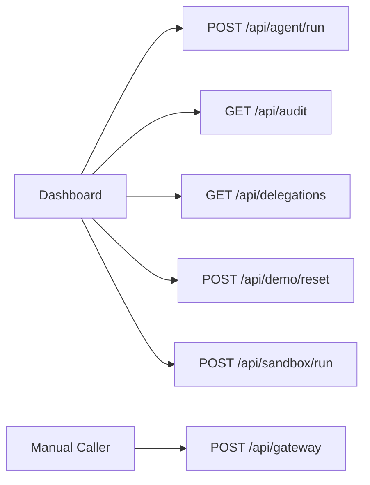

# API Reference

All API routes are implemented as Next.js App Router route handlers.

## Route Summary



## `POST /api/agent/run`

Runs one of the deterministic demo agents. The frontend uses this route so it
does not need to craft signatures directly.

Request:

```json
{
  "scenario": "trusted"
}
```

Allowed values:

```txt
trusted
sketchy
```

Response shape:

```json
{
  "agentId": "trusted-care-agent",
  "label": "TrustedCareAgent",
  "sandboxReport": {},
  "calls": [],
  "summary": {}
}
```

## `POST /api/gateway`

Runs the protected gateway decision engine for a signed healthcare API request.

Request:

```json
{
  "method": "GET",
  "path": "/fhir/patient/maya-001",
  "body": {},
  "headers": {
    "x-agent-id": "trusted-care-agent",
    "x-agent-timestamp": "2026-06-01T12:00:00.000Z",
    "x-agent-nonce": "unique-nonce",
    "x-agent-signature": "base64url-signature"
  }
}
```

Signature base string:

```txt
HEALTHAGENT-PASSPORT-V1
METHOD
PATH
BODY_HASH
TIMESTAMP
NONCE
```

Response:

```json
{
  "requestId": "uuid",
  "allowed": true,
  "httpStatus": 200,
  "decision": "allow",
  "reason": "Agent identity, sandbox behavior, patient delegation, scopes, trust route, and payment checks passed.",
  "trust": {},
  "payment": {},
  "data": {},
  "audit": {}
}
```

Decision values:

```txt
allow
deny
sandbox
throttle
```

## `POST /api/sandbox/run`

Runs a sandbox scenario and stores the `SandboxRun` record.

Request:

```json
{
  "scenario": "trusted-care-agent"
}
```

Allowed values:

```txt
trusted-care-agent
sketchy-scraper-agent
```

Response:

```json
{
  "ok": true,
  "mode": "mock",
  "runtime": "deterministic mock sandbox",
  "agentId": "trusted-care-agent",
  "riskScore": 4,
  "verdict": "clean",
  "routeImpact": "no_change",
  "signals": []
}
```

## `GET /api/audit`

Returns the latest audit events.

Response:

```json
{
  "events": []
}
```

Audit events include:

- agent ID
- patient ID
- method and path
- decision and route
- trust tier and score
- required and granted scopes
- request hash and response hash
- sandbox verdict and risk score
- latency and HTTP status
- denial or allow reason

## `GET /api/delegations`

Returns the demo patient and active trusted delegation.

Response:

```json
{
  "patient": {},
  "delegation": {
    "agentId": "trusted-care-agent",
    "patientId": "maya-001",
    "scopes": []
  }
}
```

## `POST /api/demo/reset`

Resets local demo data. Disabled in production.

Required header:

```txt
x-demo-reset-token: local-demo-reset
```

Response:

```json
{
  "ok": true
}
```

## `GET /api/health`

Returns health and feature-flag status.

Response:

```json
{
  "ok": true,
  "name": "HealthAgent Passport",
  "demoMode": {
    "valiron": "mock",
    "solana": "mock",
    "payment": "mock",
    "llm": "mock",
    "sandbox": "mock"
  }
}
```
