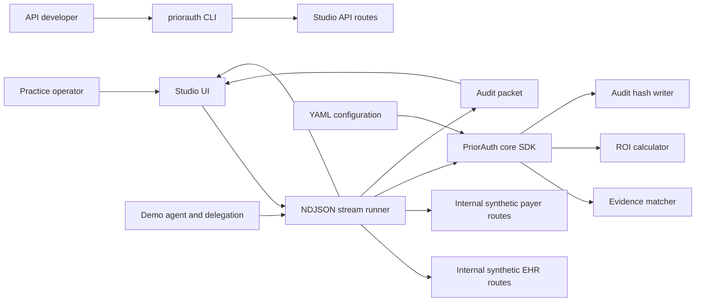
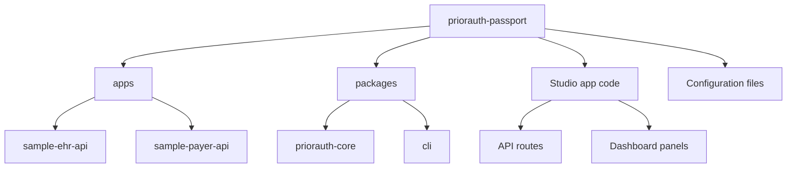
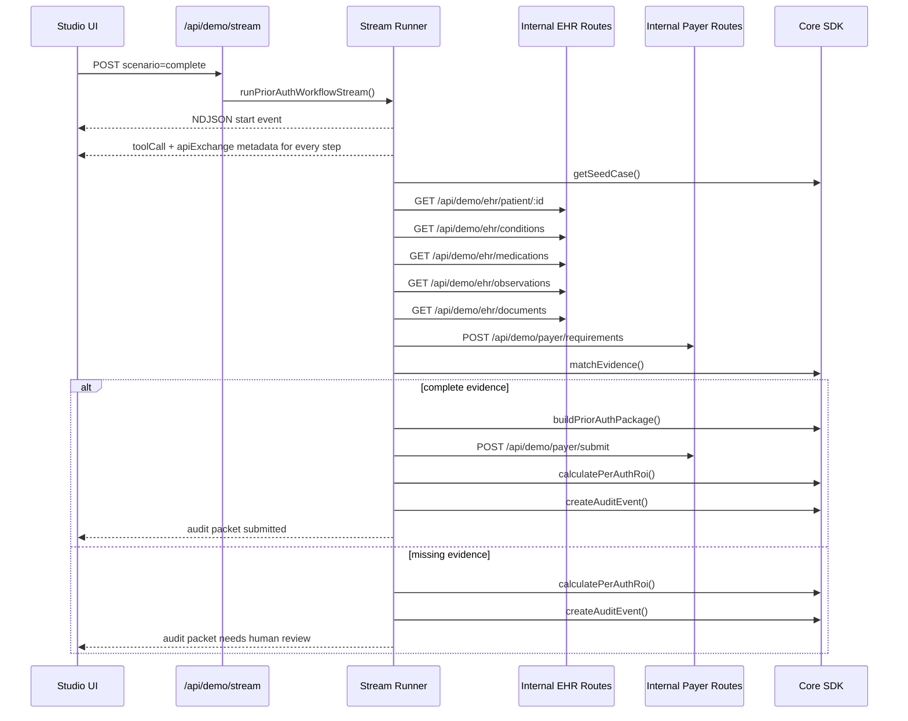
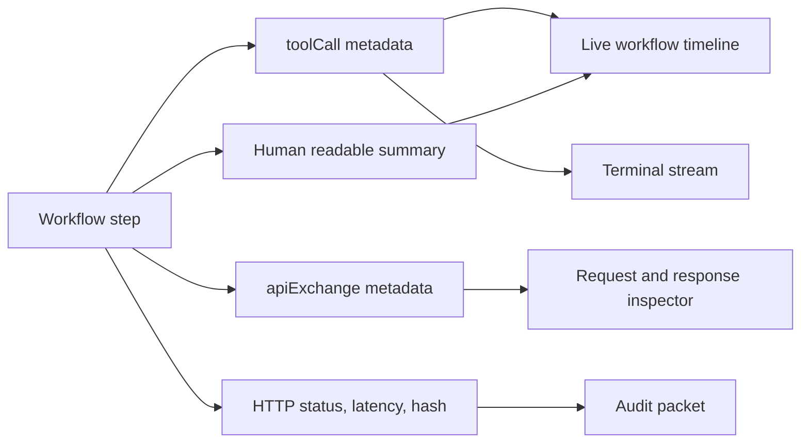
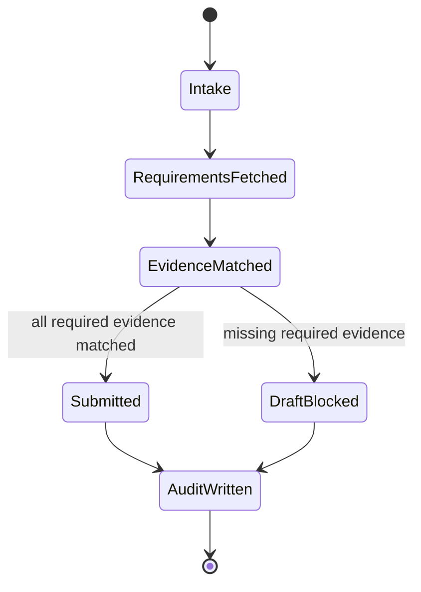
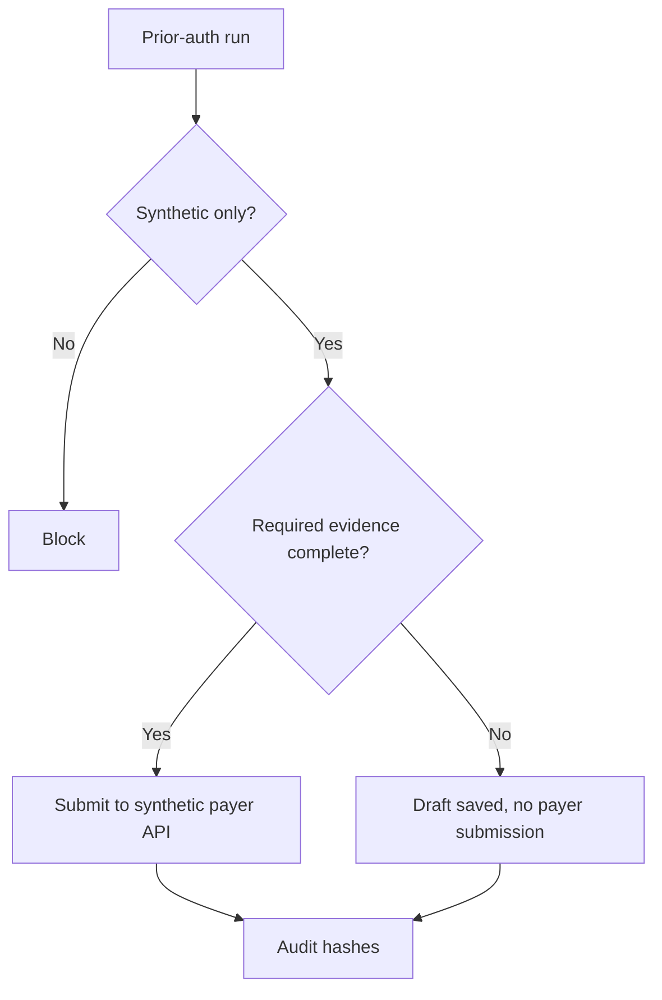

# Architecture

PriorAuth Passport is built as a hosted-ready product demo with
production-shaped interfaces: a Studio UI, internal synthetic EHR and payer API
routes, a TypeScript core SDK, CLI commands, config files, and a streaming event
model.

## Logical Architecture

## Package Layout

## Runtime Sequence

## Event Observability

The event stream is intentionally visible for demo clarity. Each action waits for
the configured `DEMO_STEP_DELAY_MS`, clamped to at least 1.2 seconds in normal
demo mode, then emits enough metadata to show what the agent called, which API
was contacted, and what evidence, ROI, proof, or audit artifact was produced.

## Evidence State Machine

## Ports

| Service | Default | Test |
| --- | ---: | ---: |
| Studio | 3000 | 3100 |
| Internal EHR routes | same host | same host |
| Internal payer routes | same host | same host |
| Optional sample EHR API | 4001 | 4101 |
| Optional sample payer API | 4002 | 4102 |

## Config Files

| File | Purpose |
| --- | --- |
| `config/roi.yaml` | Cost, time, volume, and pricing assumptions |
| `config/priorauth-policy.yaml` | Demo product safety and workflow settings |
| `config/payer-rules.yaml` | Required evidence for the demo service |
| `.priorauth/agents/*.json` | Demo agent identity files |
| `.priorauth/delegations/*.json` | Demo administrative delegation |

## Safety Architecture

