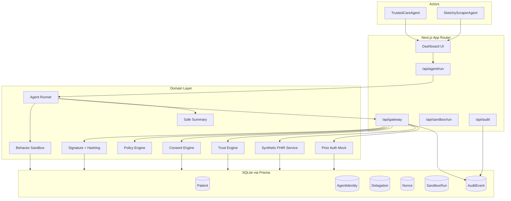
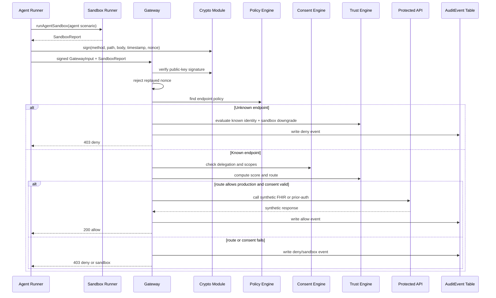
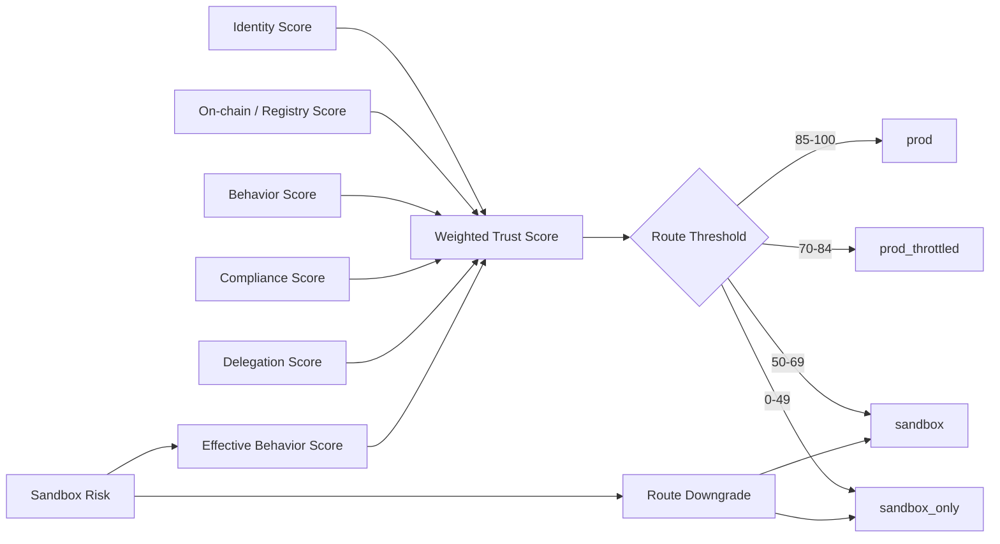
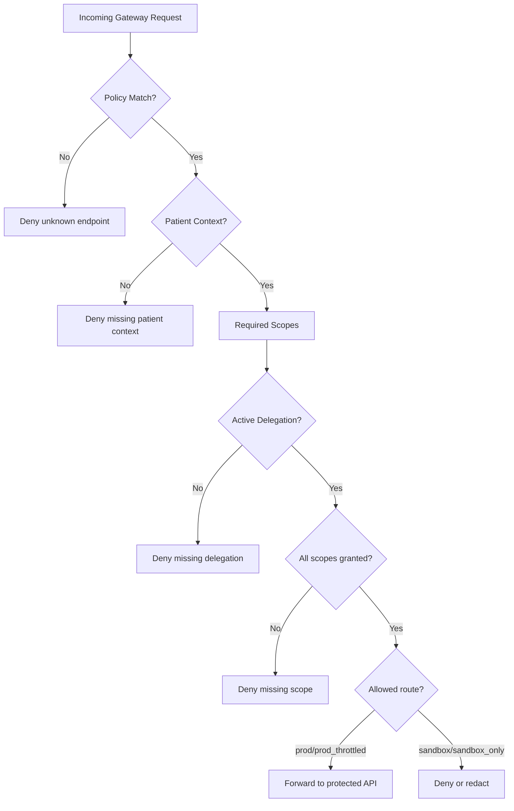
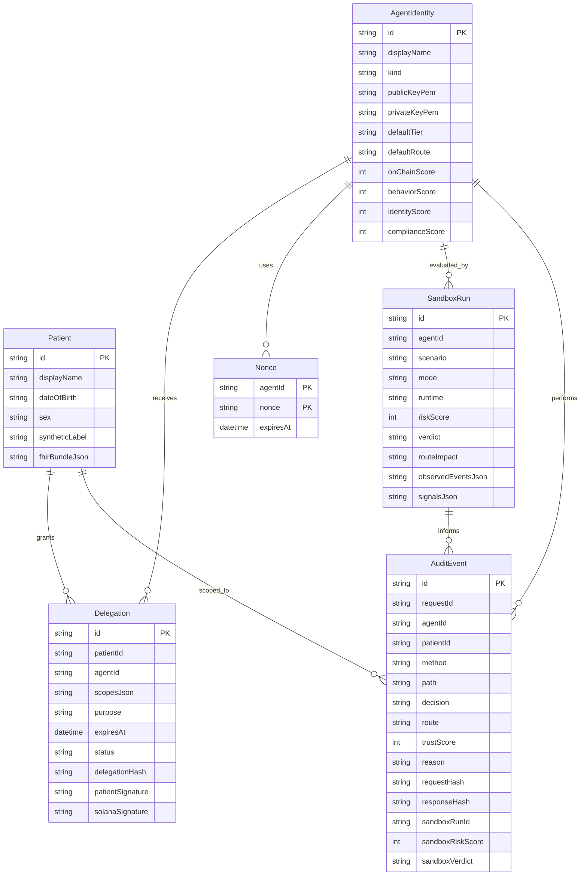
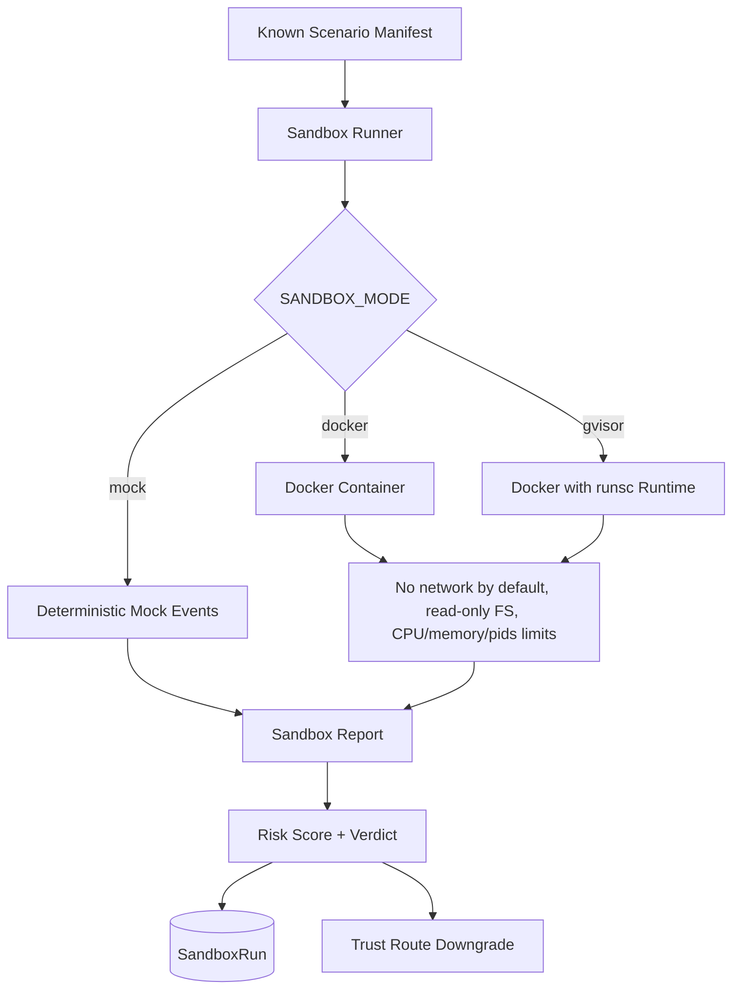
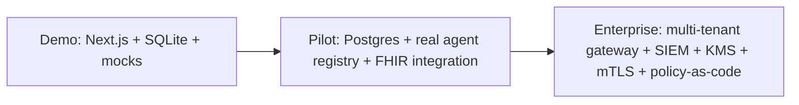

# System Architecture

HealthAgent Passport is a single full-stack Next.js app designed for a reliable
demo and a clear production roadmap. The core behavior is deterministic in mock
mode, while external integrations are kept behind feature flags.

## High-Level Architecture



## Request Lifecycle



## Trust Decision Model



Formula:

```txt
trustScore = round(
  0.20 * identityScore +
  0.25 * onChainScore +
  0.20 * behaviorScore +
  0.15 * complianceScore +
  0.20 * delegationScore
)
```

When a sandbox report exists:

```txt
sandboxBehaviorScore = 100 - sandboxRiskScore
effectiveBehaviorScore = min(agent.behaviorScore, sandboxBehaviorScore)
```

The sandbox can downgrade a route. It cannot override missing consent.

## Endpoint Policy Model



Current endpoint policies:

| Method | Path | Required scopes |
| --- | --- | --- |
| `GET` | `/fhir/patient/:patientId` | `patient/Patient.read`, `patient/Condition.read`, `patient/MedicationRequest.read`, `patient/Observation.read` |
| `POST` | `/prior-auth` | `payer/PriorAuth.write` |
| `GET` | `/fhir/all?dump=true` | No policy. Always denied. |

## Data Model



## Behavioral Sandbox Architecture



The sandbox intentionally runs known scenario manifests, not arbitrary frontend
code. This keeps the hackathon demo deterministic and avoids unsafe execution.

## Runtime Modes

| Mode | Default | Purpose |
| --- | --- | --- |
| `VALIRON_MODE=mock` | Yes | Local trust routing without sponsor dependency |
| `SOLANA_MODE=mock` | Yes | Consent hash anchor display without wallet dependency |
| `PAYMENT_MODE=mock` | Yes | x402/MPP-style receipt display without settlement |
| `LLM_MODE=mock` | Yes | Deterministic care-admin summary |
| `SANDBOX_MODE=mock` | Yes | Deterministic behavior scoring |
| `SANDBOX_MODE=gvisor` | No | Optional Linux/gVisor sandbox runtime |

## Production Roadmap


