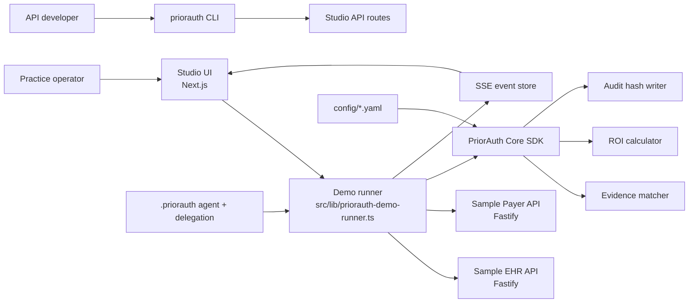
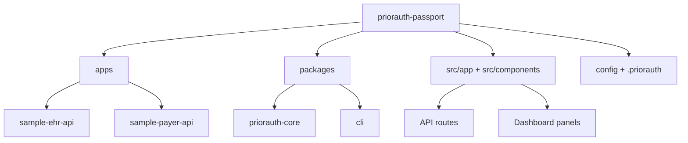
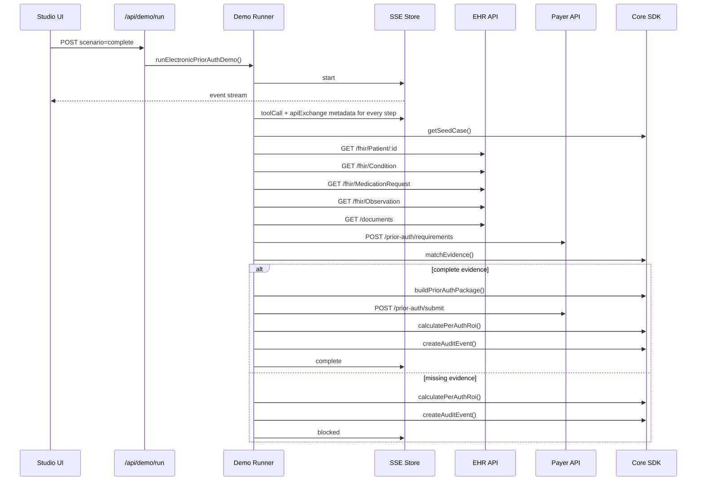
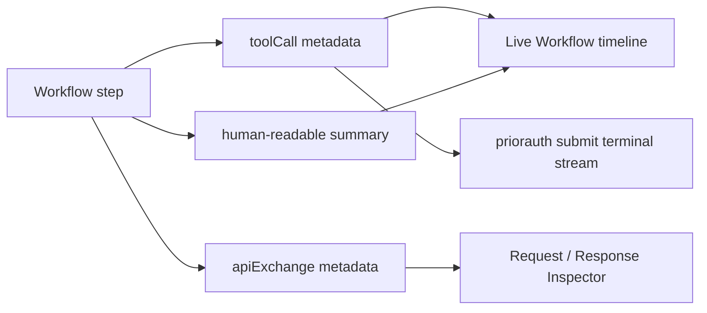
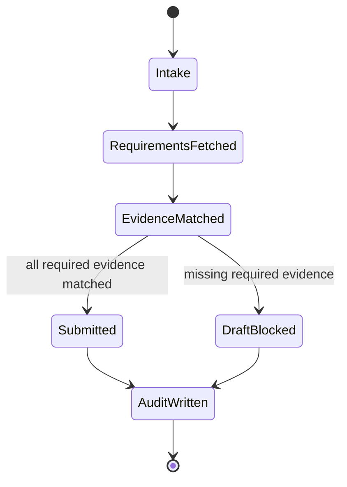
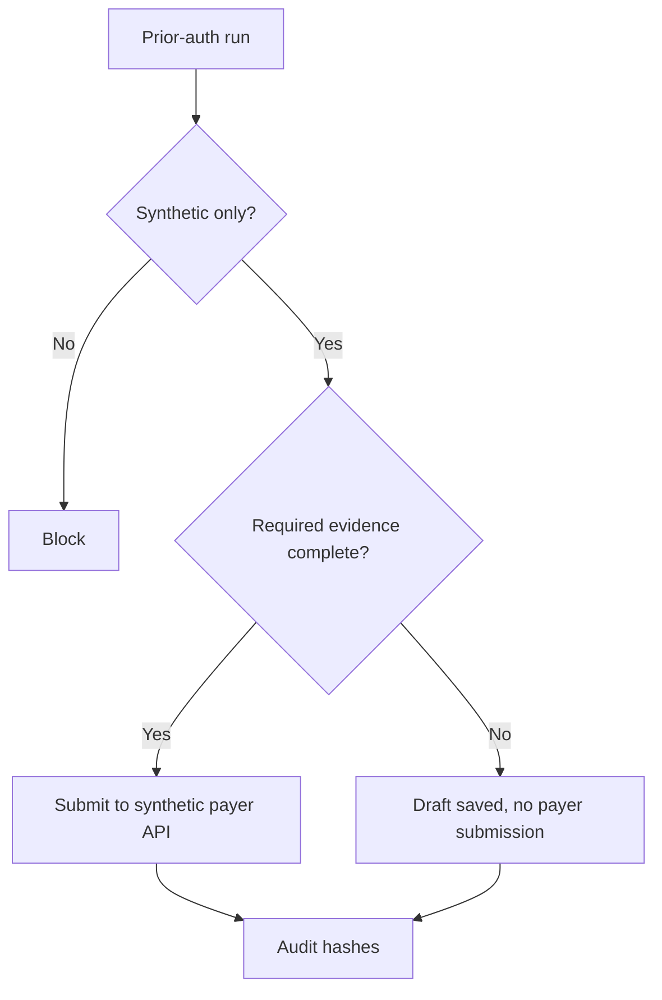

# Architecture

PriorAuth Passport is built as a demoable local product with production-shaped
interfaces: a Studio UI, real HTTP EHR and payer services, a TypeScript core SDK,
CLI commands, config files, and a streaming event model.

## Logical Architecture

## Package Layout

## Runtime Sequence

## Event Observability

The event stream is intentionally verbose for demo clarity. Each action waits
for the configured `DEMO_STEP_DELAY_MS`, then emits enough metadata to show what
the agent called, which API was contacted, and what evidence or ROI artifact was
produced.

## Evidence State Machine

## Ports

| Service | Default | Test |
| --- | ---: | ---: |
| Studio | 3000 | 3100 |
| Sample EHR API | 4001 | 4101 |
| Sample Payer API | 4002 | 4102 |

## Config Files

| File | Purpose |
| --- | --- |
| `config/roi.yaml` | Cost, time, volume, and pricing assumptions |
| `config/priorauth-policy.yaml` | Demo product safety and workflow settings |
| `config/payer-rules.yaml` | Required evidence for the demo service |
| `.priorauth/agents/*.json` | Demo agent identity files |
| `.priorauth/delegations/*.json` | Demo administrative delegation |

## Safety Architecture

