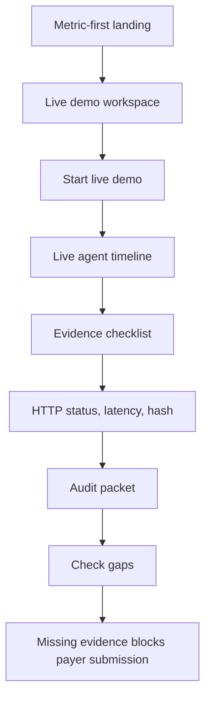

# Demo Guide

Use this when presenting PriorAuth Passport live.

## Story

"Prior authorization is an administrative workflow with expensive manual steps:
checking payer requirements, searching the chart, attaching documents, and
proving ROI. PriorAuth Passport turns that into a real-time electronic workflow
with evidence guardrails, payer submission, and audit proof."

## Demo Flow



## Presenter Script

1. Start with the user: practice operations managers and API developers.
2. Open Studio from `pnpm studio`.
3. Show the metric-first landing: cost, time, evidence, and proof status.
4. Point to the two workflows:
   manual is `$10.97` and `16 min`; electronic is `$5.79` and `9 min`.
5. Click `Start live demo`.
6. Narrate the live steps:
   - EHR patient, condition, medication, observation, and document reads
   - Payer requirement discovery
   - Evidence matching
   - Package build
   - Payer submission
   - ROI calculation
   - Audit hash generation
7. Point to Tool Calls, Data Ingest, Request / Response, and Proof of Work.
8. Show `PA-DEMO-1001`, `pending_payer_review`, and the audit packet.
9. Show ROI carefully:
   - Mode A: `$5.18` transaction savings
   - Mode B: `7 min` baseline time saved
   - Mode C: labor dollar sensitivity only if toggled
10. Click `Check gaps`.
11. Show missing recent observation and referral note.
12. Emphasize that no payer submission is sent when required evidence is
    missing.
13. Open Developer Mode and show the CLI/SDK path.

## Demo Guarantees

| Claim | Where it appears |
| --- | --- |
| Real-time workflow | Live timeline via NDJSON stream |
| Hosted infrastructure | Same-origin EHR and payer route handlers |
| Agentic visibility | Tool Calls panel plus API request/response inspector |
| API proof | HTTP status, latency, and hash rows |
| ROI proof | ROI calculator and config/roi.yaml |
| Evidence safety | Evidence checklist and blocked incomplete case |
| Audit trail | Prior Authorization Audit Packet |
| Synthetic data only | Hero badges, API health, security docs |

## Recovery

If the UI is stale, click `Reset demo` or restart Studio:

```bash
pnpm studio
```

If counters look stale, click `Reset demo`.
