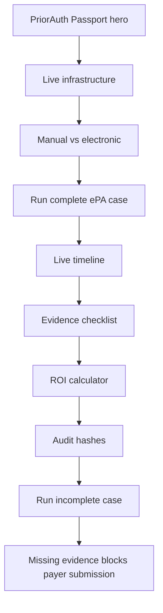

# Demo Guide

Use this when presenting PriorAuth Passport live.

## Story

"Prior authorization is an administrative workflow with expensive manual steps:
checking payer requirements, searching the chart, attaching documents, and
proving ROI. PriorAuth Passport turns that into a real-time electronic workflow
with evidence guardrails, payer submission, and audit proof."

## Demo Flow



## Presenter Script

1. Start with the user: practice operations managers and API developers.
2. Show the terminal readiness box from `pnpm demo`.
3. Open Studio and show the Overview tab: what the product does, services,
   system map, and market assumptions.
4. Point to the two workflows:
   manual is `$10.97` and `16 min`; electronic is `$5.79` and `9 min`.
5. Open Prior Auth Inbox and run the complete ePA case.
6. Narrate the live steps:
   - EHR patient, condition, medication, observation, and document reads
   - Payer requirement discovery
   - Evidence matching
   - Package build
   - Payer submission
   - ROI calculation
   - Audit hash generation
7. In Live Workflow, point to Tool Calls and Request / Response Inspector.
8. Show `PA-DEMO-1001` and `pending_payer_review`.
9. Show ROI carefully:
   - Mode A: `$5.18` transaction savings
   - Mode B: `7 min` baseline time saved
   - Mode C: labor dollar sensitivity only if toggled
10. Run `Run incomplete documentation case`.
11. Show missing recent observation and referral note.
12. Emphasize that no payer submission is sent when required evidence is
    missing.
13. Open Developer Mode and show the CLI/SDK path.

## Demo Guarantees

| Claim | Where it appears |
| --- | --- |
| Real-time workflow | Live timeline via server-sent events |
| Real infrastructure | Fastify EHR and payer APIs on local ports |
| Agentic visibility | Tool Calls panel plus API request/response inspector |
| ROI proof | ROI calculator and config/roi.yaml |
| Evidence safety | Evidence checklist and blocked incomplete case |
| Audit trail | Evidence hash and ROI hash |
| Synthetic data only | Hero badges, API health, security docs |

## Recovery

If the UI says a service is offline, stop the terminal and run:

```bash
pnpm demo
```

If counters look stale, click `Reset demo`.
