# Demo Guide

This guide is for running a clear live demo of HealthAgent Passport.

## Setup

```bash
pnpm install
pnpm demo
```

Open `http://localhost:3000`.

## Visual Walkthrough

```mermaid
flowchart LR
  Hero[Hero: installable gateway] --> Quickstart[Developer Quickstart]
  Quickstart --> Status[Live Service Status]
  Status --> Controls[Demo Controls]
  Controls --> Trusted[Run TrustedCareAgent]
  Trusted --> Timeline[Live Timeline]
  Timeline --> Granted[ACCESS GRANTED + Upstream Hit]
  Granted --> Sketchy[Run SketchyScraperAgent]
  Sketchy --> Denied[ACCESS DENIED + Bulk Hits Stay 0]
  Denied --> Inspector[Request / Decision / Audit Inspector]
```



## Opening Script

Healthcare APIs were built for humans and apps, not autonomous AI agents. Before
an agent touches patient records, payer APIs, pharmacy workflows, or public
health infrastructure, we need to know:

```txt
Who is this agent?
What is it allowed to access?
How does it behave under observation?
Should it be routed to production, throttled, sandboxed, or blocked?
```

HealthAgent Passport answers those questions before forwarding a request. The
product is the gateway and SDK; Studio is the live control plane.

## Positioning Script

Use the `Where HealthAgent Passport sits` panel before running the agents.

```txt
We are not trying to replace the identity provider, API gateway, or
agent-security vendor. Okta tells you who the agent is. Kong routes the agent.
Valiron can score and monetize the call. HealthAgent Passport decides whether
this agent may touch this patient's healthcare data for this task.
```

## Trusted Agent Flow

Click `Run TrustedCareAgent`.

Expected result:

```txt
ACCESS GRANTED
Trust score: 97/100
Tier: AAA
Route: prod
Sandbox: CLEAN risk 4/100
FHIR resources: 5
Prior auth: pa-demo-...
Upstream API called: yes
Audit evidence written
```

Talk track:

```txt
TrustedCareAgent signs its request. The gateway verifies identity, prevents
replay, checks Maya's active delegation, validates the required scopes, observes
clean sandbox behavior, computes a prod trust route, writes an audit event, and
only then calls the real sample upstream API on port 4001.
```

## Sketchy Agent Flow

Click `Run SketchyScraperAgent`.

Expected result:

```txt
ACCESS DENIED
Trust score: 15/100
Tier: C
Route: sandbox_only
Sandbox: BLOCK risk 96/100
Protected upstream API not called
Bulk dump hits: 0
Audit evidence written
```

Talk track:

```txt
SketchyScraperAgent tries a bulk dump path. The behavioral sandbox detects
secret probing, filesystem probing, outbound network intent, and bulk access.
The route is downgraded to sandbox_only, and the gateway denies access before
the upstream API is called.
```

## Closing Line

```txt
Identity tells us who the agent claims to be.
Consent tells us what it may access.
Sandboxing tells us how it behaves.
HealthAgent Passport turns those signals into a route decision and audit trail.
```

## Demo Checklist

- Page loads and hero is understandable in 10 seconds.
- Developer quickstart shows CLI and SDK usage.
- Service status shows Sample API, Gateway, Studio event stream, and policy.
- Patient card shows Maya Patel.
- Consent hash and mock Solana anchor are visible.
- `Run TrustedCareAgent` shows `ACCESS GRANTED`.
- Trusted route is `prod`.
- Timeline streams every gateway step.
- Upstream proof shows FHIR read and prior-auth counters increased.
- `Run SketchyScraperAgent` shows `ACCESS DENIED`.
- Sketchy route is `sandbox_only`.
- Sketchy sandbox result is `BLOCK risk 96/100`.
- UI states that protected upstream was not called.
- Bulk dump hits remain `0`.

## Troubleshooting

If the page opens on a different port, use the URL printed by Next.js.

If the database looks stale:

```bash
pnpm demo:reset
```

If dependencies are missing:

```bash
pnpm install
```

If you want a full verification pass:

```bash
pnpm verify
pnpm e2e
```
