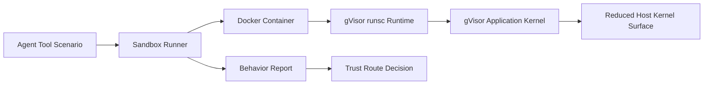
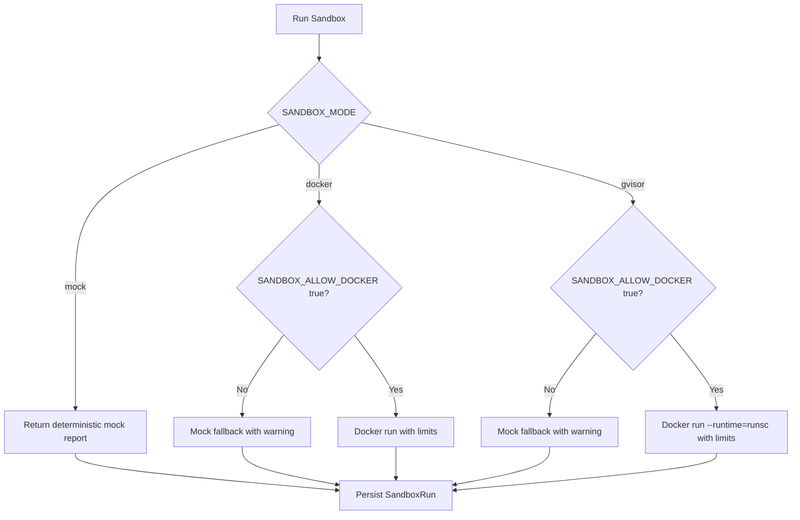

# gVisor setup for HealthAgent Passport

gVisor is optional. The app works in mock sandbox mode by default.

Use real gVisor mode only on Linux x86_64 or ARM64 with Docker installed.

## How gVisor Fits



In the default demo path, `SANDBOX_MODE="mock"` skips Docker and gVisor so the
demo works on any laptop. In gVisor mode, the same known scenario manifests run
inside a container with `runsc`.

## Runtime Decision



## Install latest gVisor release

```bash
(
  set -e
  ARCH=$(uname -m)
  URL=https://storage.googleapis.com/gvisor/releases/release/latest/${ARCH}
  wget ${URL}/runsc ${URL}/runsc.sha512 \
    ${URL}/containerd-shim-runsc-v1 ${URL}/containerd-shim-runsc-v1.sha512
  sha512sum -c runsc.sha512 \
    -c containerd-shim-runsc-v1.sha512
  rm -f *.sha512
  chmod a+rx runsc containerd-shim-runsc-v1
  sudo mv runsc containerd-shim-runsc-v1 /usr/local/bin
)
```

## Register runsc with Docker

```bash
sudo runsc install
sudo systemctl restart docker
docker run --runtime=runsc --rm hello-world
```

## Verify gVisor

```bash
docker run --runtime=runsc -it ubuntu dmesg
```

You should see gVisor startup text.

## Configure app

```env
SANDBOX_MODE="gvisor"
SANDBOX_ALLOW_DOCKER="true"
```

## Build sandbox image

```bash
docker build -f sandbox/Dockerfile -t healthagent-sandbox-runner:local sandbox
```

HealthAgent Passport treats gVisor as defense-in-depth. It does not replace
identity verification, patient consent, scope enforcement, network policy,
secret isolation, audit logging, rate limiting, or secure architecture.

## Demo Safety Notes

- Only known scenario names are accepted.
- The frontend never submits arbitrary code to execute.
- The default network mode is `none`.
- The container runs with a read-only filesystem.
- Capabilities are dropped with `--cap-drop ALL`.
- `no-new-privileges` is enabled.
- CPU, memory, and pids limits are applied.
