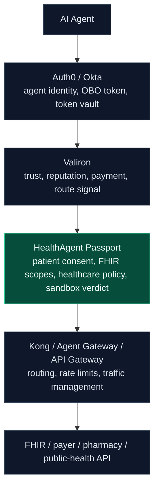
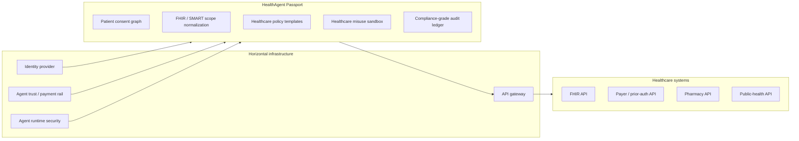
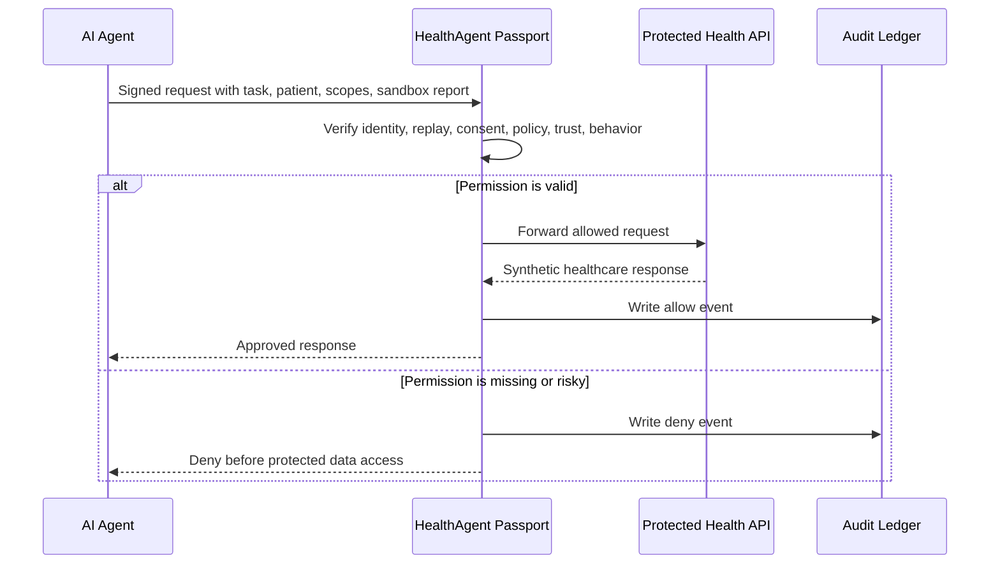

# Market Positioning

HealthAgent Passport is positioned as the missing authorization layer between
AI agents and healthcare APIs. It is not another clinical agent, identity
provider, generic API gateway, or AI runtime security product.

Core message:

```txt
Generic agent gateways know traffic.
HealthAgent Passport knows healthcare permission.
```

## Ecosystem Stack



Demo talk track:

```txt
Okta tells you who the agent is.
Kong routes the agent.
Valiron scores and monetizes agent API calls.
HealthAgent Passport decides whether that agent is allowed to touch this
patient's healthcare data for this task.
```

## Competitor Map

| Category | Examples | Relationship | HealthAgent Passport wedge |
| --- | --- | --- | --- |
| Agent identity and authorization | Auth0, Okta | Partner layer for agent identity, OBO token exchange, token vaults, and auth audit | Patient consent, FHIR/SMART scopes, healthcare endpoint policy, and task-specific permission |
| Agent trust and paid API rails | Valiron | Partner layer for route signals, reputation, payment receipts, and agent-facing API packaging | Healthcare reference implementation with consent graph, FHIR policies, prior-auth policies, and audit semantics |
| Agent / MCP / A2A gateways | Kong Agent Gateway, Linux Foundation agentgateway, Google Agent Gateway, Microsoft Foundry AI Gateway | Partner layer for routing, rate limits, MCP/A2A traffic governance, and central gateway operations | Healthcare policy brain that sits before or beside generic traffic infrastructure |
| AI runtime and agent security | HiddenLayer, Proofpoint, AppOmni, Pangea, Lakera, Protect AI | Adjacent security platforms for behavior monitoring, tool-call inspection, and exfiltration controls | Runtime decisions tied to patient delegation, health workflow scope, and protected endpoint context |
| Healthcare AI gateways and FHIR tools | DoctorConnect, FHIRBuilders, Fire Arrow | Closest healthcare-specific adjacency | Agent identity firewall for any health API, not only prebuilt agents, sandbox data, or hosted clinical workflows |
| Healthcare API security | Levo, Salt, Traceable, Noname/Akamai, Kong, Apigee | Adjacent API discovery, PHI classification, and API exposure control | AI-agent caller risk, consent-aware enforcement, sandbox behavior, and agent-specific audit |
| Prior-auth and RCM automation | Availity, Waystar/Myndshft, Rhyme, CoverMyMeds, Innovaccer | Workflow apps, not core infrastructure competitors | Prior auth is a demo workflow proving the gateway, not the product boundary |

## Product Boundary



## Why This Is Defensible

The moat is not "we have a gateway." Generic gateways can be copied or bundled
into larger platforms. The defensible surface is healthcare-specific runtime
authorization:

1. Healthcare-specific consent graph
2. FHIR/SMART scope normalization
3. Payer, prior-auth, pharmacy, and public-health policy templates
4. Agent behavioral history for health workflows
5. Compliance-grade audit exports
6. Synthetic sandbox tests for healthcare API misuse
7. Integration with horizontal players instead of replacing them

## Demo Implication

The live demo should keep repeating one simple product moment:



The product claim is narrow and strong:

```txt
We are the healthcare-specific policy brain that generic agent infrastructure
does not have.
```
