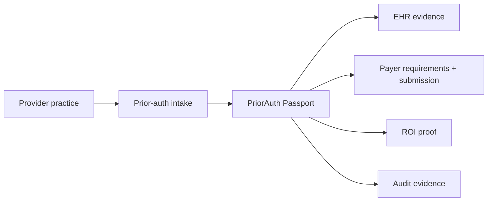
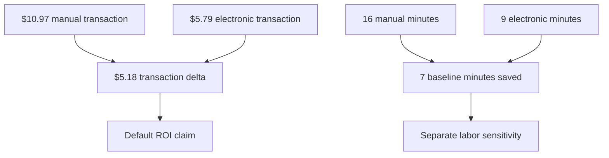

# Market Positioning

PriorAuth Passport is positioned as an API-first prior authorization
infrastructure layer, not a full revenue-cycle-management platform and not a
clinical decision engine.

## Wedge

The wedge is narrow and demoable: prove administrative savings by turning a
single prior-auth case into a real-time electronic workflow.

## Primary Buyer/User

| Segment | Need | Product answer |
| --- | --- | --- |
| Provider practice operations | Reduce manual portal/fax work and prove ROI | Live case run, missing evidence, cost/time saved |
| Health-tech API developers | Need an embeddable prior-auth reference workflow | TypeScript core, CLI, sample EHR, sample payer |
| Payer/platform teams | Need testable API-first prior-auth patterns | Requirements endpoint, submission endpoint, status endpoint |

## Competitive Frame

| Category | Examples | PriorAuth Passport difference |
| --- | --- | --- |
| RCM workflow platforms | Prior-auth work queues and services | Smaller infrastructure/API layer with demoable ROI proof |
| Clearinghouses | Network and transaction rails | Local SDK and evidence orchestration around prior-auth workflow |
| EHR-native workflows | Embedded chart tools | Cross-service evidence matching and payer package building |
| Generic agent frameworks | Agent routing and tool calling | Healthcare-specific administrative guardrails and audit semantics |

## Why Now

The market is moving toward API-first prior authorization. PriorAuth Passport
lets teams show a concrete implementation path: real HTTP services, structured
requirements, evidence matching, electronic submission, and event-level audit.

## ROI Narrative

The product should lead with the default transaction delta and then let users
toggle labor sensitivity when they want a staffing model.
