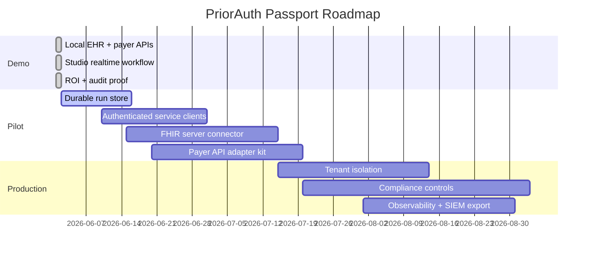
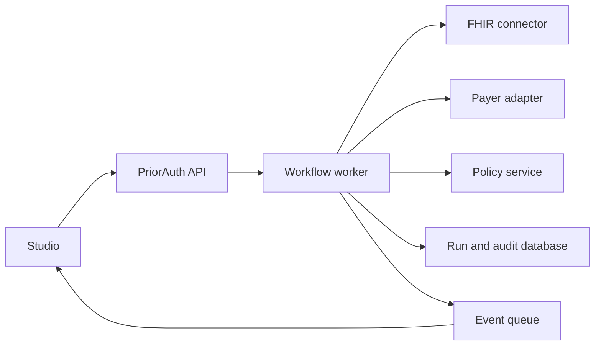

# Production Roadmap

The current repo is optimized for a fast, working demo. The production path is
to keep the same interfaces while replacing synthetic components with secure,
durable infrastructure.

## Roadmap

## Replaceable Demo Parts

| Demo component | Production replacement |
| --- | --- |
| In-memory event store | Postgres, Kafka, or durable workflow event table |
| Sample EHR API | FHIR server connector with OAuth/OIDC |
| Sample payer API | Payer-specific or standards-based prior-auth adapter |
| Static agent file | KMS-backed service identity |
| Local YAML config | Versioned policy bundle with review workflow |
| Synthetic audit hashes | Immutable audit store with retention policy |

## Deployment Shape

## Non-Goals

- Do not make treatment decisions.
- Do not become a payer medical review engine.
- Do not store real PHI until compliance controls, contracts, and tenant
  isolation are in place.
