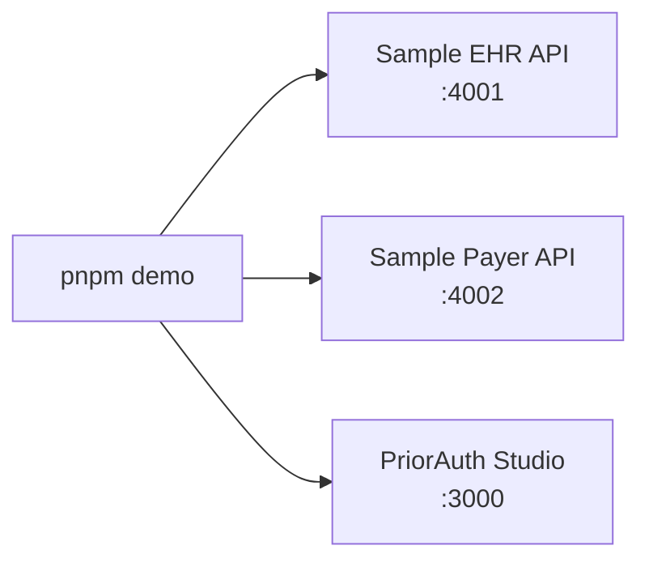

# Quickstart

## Prerequisites

- Node.js 20+
- pnpm
- No external payer, EHR, wallet, LLM, or PHI dependency

## Install

```bash
pnpm install
```

## Run the Demo

```bash
pnpm demo
```

Open [http://localhost:3000](http://localhost:3000).



## Try Both Cases

1. Click `Run complete ePA case`.
2. Watch the timeline stream EHR reads, payer requirements, evidence matching,
   package build, payer submission, ROI, and audit.
3. Click `Run incomplete documentation case`.
4. Confirm missing evidence appears and no payer submission is sent.

## CLI

```bash
pnpm --filter @priorauth/passport-cli dev doctor
pnpm --filter @priorauth/passport-cli dev submit
pnpm --filter @priorauth/passport-cli dev sign
```

## Environment

```bash
EHR_API_URL="http://localhost:4001"
PAYER_API_URL="http://localhost:4002"
DEMO_STEP_DELAY_MS="750"
ALLOW_REAL_PHI="false"
SYNTHETIC_DATA_ONLY="true"
```

## Expected Output

The complete case should show:

- Prior-auth ID like `PA-DEMO-1001`
- Payer decision `pending_payer_review`
- `$5.18` transaction savings
- `7 min` baseline time saved
- Evidence hash and ROI hash

The incomplete case should show:

- Missing `Recent observation`
- Missing `Referral note`
- `not_submitted`
- Draft audit evidence
