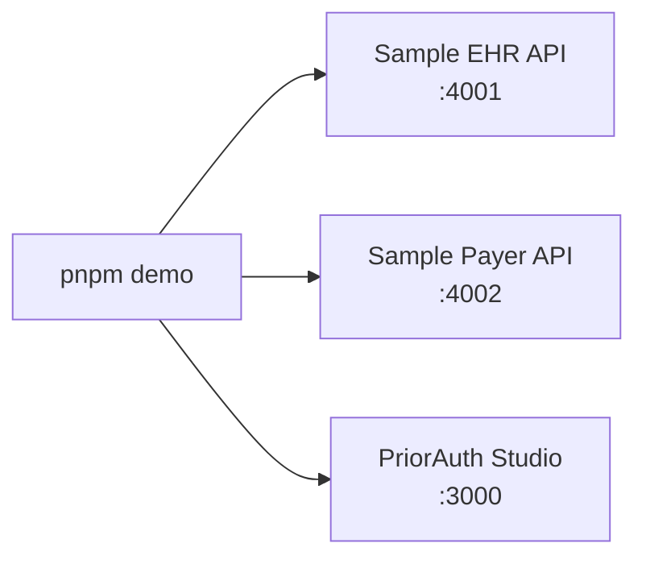

# Quickstart

## Prerequisites

- Node.js 20+
- pnpm
- No external payer, EHR, wallet, LLM, or PHI dependency

## Install

```bash
pnpm install
```

## Run the Demo

```bash
pnpm demo
```

Open [http://localhost:3000](http://localhost:3000).

The terminal waits for the real services and prints a readiness box:

```text
+--------------------------------------------------------------+
| PriorAuth Passport Demo                                      |
+--------------------------------------------------------------+
| EHR API    http://localhost:4001     healthy                 |
| Payer API  http://localhost:4002     healthy                 |
| Studio     http://localhost:3000     healthy                 |
+--------------------------------------------------------------+
```



## Try Both Cases

1. Click `Run complete ePA case`.
2. Watch the timeline stream EHR reads, payer requirements, evidence matching,
   package build, payer submission, ROI, and audit.
3. Click `Run incomplete documentation case`.
4. Confirm missing evidence appears and no payer submission is sent.

## CLI

```bash
pnpm run doctor
pnpm priorauth submit --case pa-case-001
pnpm priorauth submit --case pa-case-001 --scenario incomplete
pnpm priorauth sign
```

`pnpm priorauth submit` starts a Studio run and then polls the run events, so
the terminal and browser show the same agent actions.

## Environment

```bash
EHR_API_URL="http://localhost:4001"
PAYER_API_URL="http://localhost:4002"
DEMO_STEP_DELAY_MS="1200"
ALLOW_REAL_PHI="false"
SYNTHETIC_DATA_ONLY="true"
```

## Expected Output

The complete case should show:

- Prior-auth ID like `PA-DEMO-1001`
- Payer decision `pending_payer_review`
- `$5.18` transaction savings
- `7 min` baseline time saved
- Evidence hash and ROI hash

The incomplete case should show:

- Missing `Recent relevant observation`
- Missing `Referral note`
- `not_submitted`
- Draft audit evidence

## Studio Tabs

| Tab | Purpose |
| --- | --- |
| Overview | Product explanation, service status, system map, market assumptions |
| Prior Auth Inbox | Operator case queue with complete and incomplete demo cases |
| Live Workflow | Timeline, tool calls, request/response inspector |
| ROI Calculator | Per-case and adjustable practice-level ROI model |
| Evidence & Requirements | Payer requirements and matched/missing EHR evidence |
| Audit Ledger | API proof, audit hashes, copy/download packet |
| Developer Mode | CLI and SDK integration examples |
| Settings | ROI assumptions, payer rules, agent identity, safety boundary |
