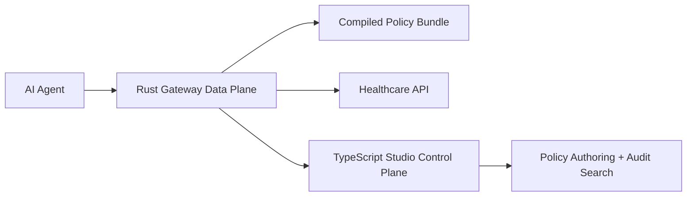

# Rust Gateway Roadmap

The hackathon product is TypeScript because adoption and demo speed matter:
the SDK, CLI, Studio dashboard, policy loader, and sample API all run in one
developer-friendly toolchain.

Rust is still a strong production path for the gateway data plane.

## Why Not Rust First

```txt
1. The core product risk is authorization semantics, not packet throughput.
2. Health API developers need an npm install and fast local demo.
3. The Studio, SDK, and CLI are naturally TypeScript.
4. A working gateway beats an unfinished high-performance rewrite.
```

## What Moves To Rust Later



Production Rust candidates:

- line-rate reverse proxy
- WASM policy execution
- mTLS and certificate pinning
- gVisor / container runtime orchestration
- high-throughput audit/event streaming
- memory-safe request parsing and body limits

## What Stays TypeScript

- CLI and SDK ergonomics
- Studio dashboard
- policy authoring workflows
- local developer demo
- integration examples for agent builders

## Pitch

```txt
For the hackathon I built the developer-facing SDK, CLI, and dashboard in
TypeScript because adoption matters. The production gateway can later move to
Rust for line-rate proxy performance and memory safety, but the product value
is already demonstrated today.
```
