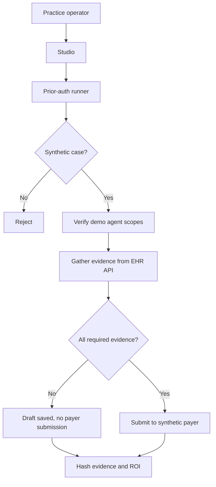
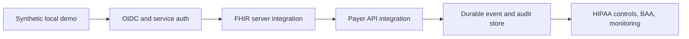

# Security Model

PriorAuth Passport is an administrative workflow demo. Its first security
feature is a bright boundary: synthetic data only, no treatment decisions, and
no medical advice.

## Boundary Diagram

## What It Does Not Do

- Does not ingest real PHI.
- Does not make medical necessity decisions.
- Does not approve or deny care.
- Does not replace payer review.
- Does not call external LLMs in the default demo.
- Does not depend on blockchains, wallets, or hosted services.

## Controls

| Control | Demo implementation |
| --- | --- |
| Synthetic data boundary | EHR and payer APIs are local sample services |
| Evidence completeness | Incomplete case stops before payer submission |
| Agent scope check | Demo agent includes administrative prior-auth scopes |
| Audit integrity | Evidence and ROI are hashed in audit events |
| Realtime observability | Every phase streams to Studio over SSE |
| Resettable state | Demo reset clears event store and API counters |

## Threat Model

| Risk | Control |
| --- | --- |
| Submitting incomplete documentation | Evidence matcher blocks and saves draft |
| Inflated ROI claims | Transaction savings and labor sensitivity are separate |
| Hidden API behavior | EHR and payer counters are visible in Studio |
| Confusing demo data with PHI | UI, docs, config, and API health mark synthetic-only |
| Lost audit context | Completion and blocked paths both create audit hashes |

## Production Hardening Path

