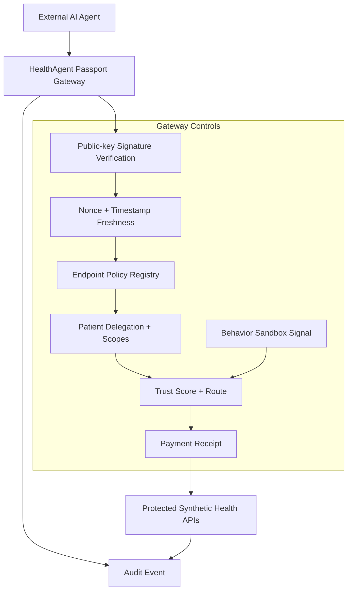
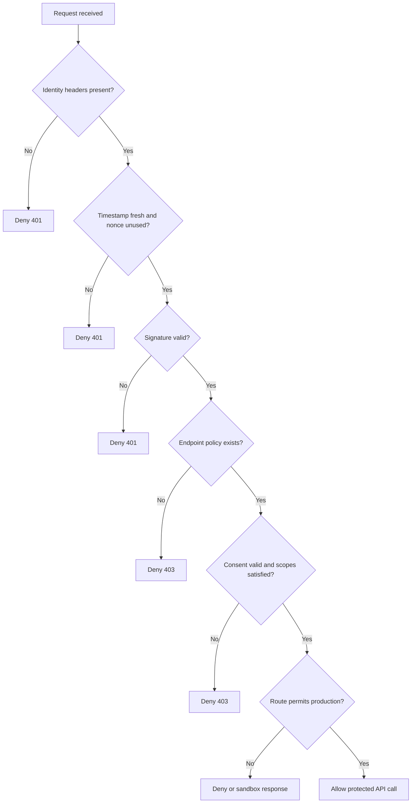
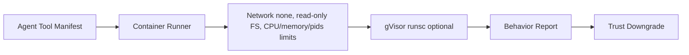
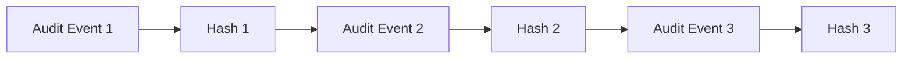

# Security Model

HealthAgent Passport is a healthcare API control plane demo. Its security
posture is intentionally layered: identity, replay protection, endpoint policy,
patient consent, trust routing, sandbox behavior, and audit logging.

## Security Boundary Diagram



## Authorization Invariants



Rules:

- Trust cannot override consent.
- Sandbox cannot grant access.
- LLM output cannot authorize access.
- Unknown endpoints are denied.
- Bulk access paths are denied unless explicitly registered in policy.
- Denied agents do not receive protected synthetic FHIR bundles.

## Threat-To-Control Map

| Threat | Control |
| --- | --- |
| Unknown agent calls a health API | Required `x-agent-id` and public-key signature |
| Agent spoofs another agent | Ed25519 signature verification |
| Replay attack | Nonce table and timestamp freshness |
| Overbroad data access | Endpoint policy and SMART-like scopes |
| Missing patient authorization | Active delegation check |
| Bulk scraping | Unknown endpoint denial and sandbox risk scoring |
| Suspicious agent behavior | Behavioral sandbox signals and route downgrade |
| Sensitive data leakage | Synthetic data only, no real PHI, no secrets passed to sandbox |
| Excessive LLM agency | LLM only summarizes approved data after gateway decision |
| Missing auditability | Every allow and deny writes an audit event |

## Sandbox Defense-In-Depth



The default sandbox is deterministic mock mode. Real Docker or gVisor mode is
opt-in through environment flags.

The sandbox is not a replacement for:

- identity verification
- patient consent
- scope enforcement
- secret isolation
- network policy
- rate limiting
- audit logging
- secure architecture

## Data Safety

HealthAgent Passport uses a small embedded synthetic FHIR-like bundle for
`maya-001`. It does not ingest or process real PHI.

The app labels responses and UI surfaces with:

```txt
Synthetic data only
No PHI
No diagnosis
No treatment recommendation
```

## Key Handling

Demo agent private keys are stored in SQLite to make the demo self-contained.
That is explicitly a demo-only shortcut.

Production should use:

- external agent key registry
- KMS-backed signing keys
- no private keys in application tables
- tenant-isolated key ownership
- key rotation and revocation

## Audit Model

Each gateway decision records:

- request ID
- agent and patient context
- method and path
- decision and route
- trust score and tier
- required and granted scopes
- request and response hashes
- sandbox run ID, risk, and verdict
- latency, status code, and reason

Future production work can add tamper-evident hash chaining:


